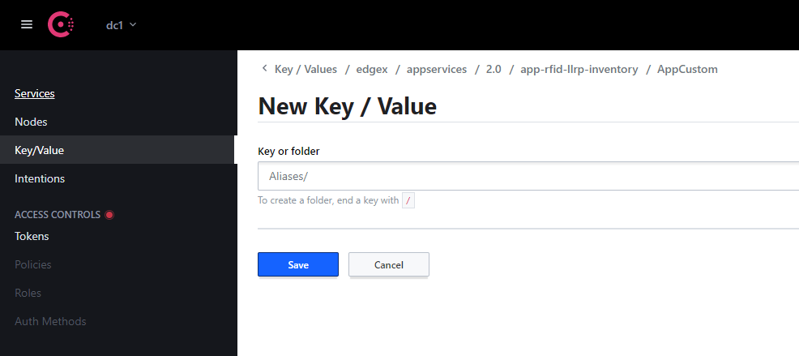
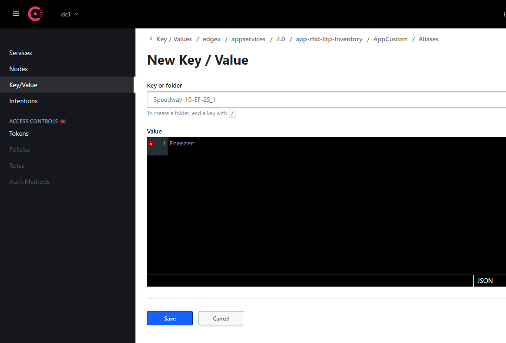

# RFID LLRP Inventory Application Service
[](https://jenkins.edgexfoundry.org/view/EdgeX%20Foundry%20Project/job/edgexfoundry/job/app-rfid-llrp-inventory/job/main/) [](https://goreportcard.com/report/github.com/edgexfoundry/app-rfid-llrp-inventory) [](https://github.com/edgexfoundry/app-rfid-llrp-inventory/tags)  [](https://choosealicense.com/licenses/apache-2.0/)  [](https://github.com/edgexfoundry/app-rfid-llrp-inventory/pulls) [](https://github.com/edgexfoundry/app-rfid-llrp-inventory/contributors) [](https://github.com/orgs/edgexfoundry/teams/app-rfid-llrp-inventory-committers/members) [](https://github.com/edgexfoundry/app-rfid-llrp-inventory/commits)

## Overview
RFID LLRP Inventory - Edgex application service for processing tag reads,
producing events [`Arrived`, `Moved`, `Departed`], configure and manage the LLRP readers via commands

**Build Native**
```bash
make build
```
**Build Docker**
```bash
make docker
```

## Inventory Events
There are 3 basic inventory events that are generated and sent to EdgeX's core-data. 
Here are some example `EdgeX Events` with accompanying `EdgeX Readings`.

- **`InventoryEventArrived`**
```json
{
  "apiVersion": "v2",
  "id": "6def8859-5a12-4c83-b68c-256303146682",
  "deviceName": "rfid-llrp-inventory",
  "profileName": "rfid-llrp-inventory",
  "sourceName" : "rfid-llrp-inventory",
  "origin": 1598043284109799400,
  "readings": [
    {
      "apiVersion": "v2",
      "id": "8d15d035-402f-4abc-85fc-a7ed7213122a",
      "origin": 1598043284109799400,
      "deviceName": "rfid-llrp-inventory",
      "resourceName": "InventoryEventArrived",
      "profileName": "rfid-llrp-inventory",
      "valueType": "String",
      "value": "{\"epc\":\"30340bb6884cb101a13bc744\",\"tid\":\"\",\"timestamp\":1598043284104,\"location\":\"SpeedwayR-10-EF-25_1\"}"
    }
  ]
}
```

- **`InventoryEventMoved`**
```json
{
  "apiVersion": "v2",
  "id": "c78c304e-1906-4d17-bf26-5075756a231f",
  "deviceName": "rfid-llrp-inventory",
  "profileName": "rfid-llrp-inventory",
  "sourceName" : "rfid-llrp-inventory",
  "origin": 1598401259697580500,
  "readings": [
    {
      "apiVersion": "v2",
      "id": "323694d9-1a48-417a-9f43-25998536ae8f",
      "origin": 1598401259697580500,
      "deviceName": "rfid-llrp-inventory",
      "resourceName": "InventoryEventMoved",
      "profileName": "rfid-llrp-inventory",
      "valueType": "String",
      "value": "{\"epc\":\"30340bb6884cb101a13bc744\",\"tid\":\"\",\"timestamp\":1598401259691,\"old_location\":\"Freezer\",\"new_location\":\"Kitchen\"}"
    }
  ]
}
```

- **`InventoryEventDeparted`**
```json
{
  "apiVersion": "v2",
  "id": "4d042708-c5de-41fa-827a-3f24b364c6de",
  "deviceName": "rfid-llrp-inventory",
  "profileName": "rfid-llrp-inventory",
  "sourceName" : "rfid-llrp-inventory",
  "origin": 1598062424894043600,
  "readings": [
    {
      "apiVersion": "v2",
      "id": "928ff90d-02d1-43be-81a6-a0d75886b0e4",
      "origin": 1598062424894043600,
      "deviceName": "rfid-llrp-inventory",
      "resourceName": "InventoryEventDeparted",
      "profileName": "rfid-llrp-inventory",
      "valueType": "String",
      "value": "{\"epc\":\"30340bb6884cb101a13bc744\",\"tid\":\"\",\"timestamp\":1598062424893,\"last_read\":1598062392524,\"last_known_location\":\"SpeedwayR-10-EF-25_1\"}"
    },
    {
      "apiVersion": "v2",
      "id": "abfff90d-02d1-43be-81a6-a0d75886cdaf",
      "origin": 1598062424894043600,
      "deviceName": "rfid-llrp-inventory",
      "resourceName": "InventoryEventDeparted",
      "profileName": "rfid-llrp-inventory",
      "valueType": "String",
      "value": "{\"epc\":\"30340bb6884cb101a13bc688\",\"tid\":\"\",\"timestamp\":1598062424893,\"last_read\":1598062392512,\"last_known_location\":\"POS Terminals\"}"
    }
  ]
}
```

> **Note:** The `readings` field of the `EdgeX Event` is an array and multiple Inventory Events may
> be sent via a single `EdgeX Event`. Each `EdgeX Reading` corresponds to a single Inventory Event.


### Arrived
Arrived events are generated when _**ANY**_ of the following conditions are met:
- A tag is read that has never been read before
- A tag is read that is currently in the Departed state
- A tag aged-out of the inventory and has been read again

### Moved
Moved events are generated when _**ALL**_ of the following conditions are met:
- A tag is read by an Antenna (`Incoming Antenna`) that is not the current Location
- The `Incoming Antenna`'s Alias does not match the current Location's Alias
- The `Incoming Antenna` has read that tag at least `2` times total (including this one)
- The moving average of RSSI values from the `Incoming Antenna` are greater than the 
  current Location's _**adjusted**_ moving average _([See: Mobility Profile](#Mobility-profile))_

### Departed
Departed events are generated when:
- A tag is in the `Present` state and has not been read in more than 
  the configured `DepartedThresholdSeconds`

_NOTE: Departed tags have their tag statistics cleared, essentially resetting any values used
       by the tag algorithm. So if this tag is seen again, the Location will be set to the
       first Antenna that reads the tag again._

### Tag State Machine
Here is a diagram of the internal tag state machine. Every tag starts in the `Unknown` state (more precisely does not exist at all in memory). 
Throughout the lifecycle of the tag, events will be generated that will cause it to move between
`Present` and `Departed`. Eventually once a tag has been in the `Departed` state for long enough
it will "Age Out" which removes it from memory, effectively putting it back into the `Unknown` state.


## Tag Location Algorithm

Every tag is associated with a single `Location` which is the best estimation of the Reader and Antenna
that this tag is closest to.

The location algorithm is based upon comparing moving averages of various RSSI values from each RFID Antenna. Over time
these values will be decayed based on the configurable [Mobility Profile](#Mobility-profile). Once the
algorithm computes a higher adjusted value for a new location, a Moved event is generated.

> **RSSI** stands for Received Signal Strength Indicator. It is an estimated measure of power (in dBm) that the RFID reader
> receives from the RFID tag's backscatter. 
>
> In a perfect world as a tag gets closer to an antenna the
> RSSI would increase and vice-versa. In reality there are a lot of physics involved which make this
> a less than accurate representation, which is why we apply algorithms to the raw RSSI values. 

**Note:** _Locations are actually based on `Aliases` and multiple antennas may be mapped to the 
same `Alias`, which will cause them to be treated as the same within the tag algorithm. This can be
especially useful when using a dual-linear antenna and mapping both polarities to the same `Alias`._


### Configuration

The following configuration options in the `[ApplicationSettings]` section affect how the tag location algorithm works under the hood.

- **`AdjustLastReadOnByOrigin`** *`[bool]`*: If `true`, this will override the tag read timestamps sent from the sensor
        with an adjusted one based on the UTC time the `LLRP Device Service` received the message from the device (aka `Origin`). 
        Essentially all timestamps will be shifted by the difference in time from when the sensor says it was read versus when it
        was actually received. This option attempts to account for message latency and time drift between sensors by standardizing 
        all timestamps. If `false`, timestamps will retain their original values sent from the sensor.
  - default: `true`
  - computation: `readOn = (Origin - sentOn) + readOn`

- **`DepartedThresholdSeconds`** *`[int]`*: How long in seconds a tag should not be read before 
        it will generate a `Departed` event.
  - default: `600`

- **`DepartedCheckIntervalSeconds`** *`[int]`*: How often to run the background task that checks if a Tag needs
        to be marked `Departed`. Smaller intervals will cause more frequent checks and less variability at the expense of
        CPU utilization and lock contention. Larger intervals on the other hand may cause greater latency
        between when a tag passes the `DepartedThresholdSeconds` and when the `Departed` event is actually
        generated (waiting for the next check to occur).
  - default: `30`
  
- **`AgeOutHours`** *`[int]`*: How long in hours to keep `Departed` tags in our in-memory inventory before they 
        are aged-out (purged). This is done for CPU and RAM conservation in deployments with a large
        turnover of unique tags. An aged-out tag will be purged from memory and if it is 
        read again it will be treated as the first time seeing that tag.
  - default: `336` _(aka: 2 weeks)_

### Mobility Profile

The following configuration options define the `Mobility Profile` values.
These values are used in the Location algorithm as an adjustment function which
will decay RSSI values over time. This offset value is then applied to the existing Tag's Location
and compared to the non-adjusted average. Positive `offset` values will increase the likelihood of a tag
staying in the same location, whereas negative `offset` values will increase the likelihood that the tag
will move to the new location it was just read at.

The main goal of the Mobility Profile is to provide a way to customize the various tradeoffs when
dealing with erratic data such as RSSI values. In general there is a tradeoff between responsiveness
(how quickly tag movement is detected) and stability (preventing sporadic readings from generating erroneous events).
By tweaking these values you will be able to find the balance that is right for your specific use-case.

Suppose the following variables:
- **`incomingRSSI`** Mean RSSI of last `windowSize` reads by incoming read's location 
- **`existingRSSI`** Mean RSSI of last `windowSize` reads by tag's existing location
- **`offset`** Result of Mobility Profile's computations

The location will change when the following equation is true:
- `incomingRSSI > (existingRSSI + offset)`


#### Configure Mobility Profile
_Note: All values can be modified via the `[ApplicationSettings]` section.

- **`MobilityProfileSlope`** *`[float]`*: Used to determine the offset applied to older RSSI values (aka rate of decay)
  - units: `dBm per millisecond`

- **`MobilityProfileThreshold`** *`[float]`*: RSSI threshold that must be exceeded for the tag to move from the previous sensor
  - units: `dBm`

- **`MobilityProfileHoldoffMillis`** *`[float]`*: Amount of time in which the offset used is equal to the threshold, effectively the slope is not used
  - units: `milliseconds`

#### Example Mobility Profile Values

Here are some example mobility profile values based on our previous experience.
These values can be used as a reference when creating your own Mobility Profile.

| **Asset Tracking** \* |        |
|-----------------------|--------|
| Slope                 | -0.008 |
| Threshold             | 6.0    |
| Holdoff Millis        | 500.0  |

_\* These are the default mobility profile values._

| **Retail Garment** |         |
|--------------------|---------|
| Slope              | -0.0005 |
| Threshold          | 6.0     |
| Holdoff Millis     | 60000.0 |


## Setting the Aliases

Every device(reader) + antenna port represents a tag location and can be assigned an alias 
such as Freezer, Backroom etc. to give more meaning to the data. The default alias set by the 
application has a format of `<deviceName>_<antennaId>` e.g.
`Reader-10-EF-25_1` where `Reader-10-EF-25` is the deviceName and `1` is the antennaId.

To get the list of LLRP devices or readers connected,
`GET` to the `/api/v2/readers` endpoint:   
                                                       

    curl -o- localhost:59711/api/v1/readers

```json
{
  "Readers": [
    "SpeedwayR-10-EF-25"
  ]
}
```

### Via configuration.toml (before deployment)
If you already know the alias values you would like to use before deployment, they can be defined in your
`configuration.toml` file. There is a section called `[Aliases]` under the `[AppCustom]` section that is defaulted to empty.

In order to override an alias, set the default alias as the key, and the new alias as the value you want, such as:

    [Aliases]
    Reader-10-EF-25_1 = "Freezer"
    Reader-10-EF-25_2 = "Backroom"

##### Configuration for Normal Service Startup
If an existing `Aliases` folder key (even if empty) is found in Consul, nothing is done. Data in Consul
will be left as-is.

If no existing `Aliases` folder key is found in Consul:
- If an `[Aliases]` section is **not present** or **is empty** in the user's TOML file, nothing will be done or added to Consul.
- If an `[Aliases]` section is **present and contains data**, this data will be uploaded to Consul.

##### Overwrite Config in Consul (During Development)
During development, the user also has the option to pass the `-o/--overwrite` command line flag
to the service. In addition to what EdgeX normally does when this is passed, the Aliases are read
from the TOML file and uploaded to Consul, overwriting existing Aliases with the same key. 

> _One thing to be aware of however is that the Aliases are treated as Key/Value pairs so any Alias
> key in Consul that is not present in the TOML file will **not** be deleted from Consul. Read
> below for an example scenario._

###### Scenario
Consul already contains the following key/values:
- `rfid-llrp-inventory/AppCustom/Aliases/Reader-10-EF-25_1` = `POS`
- `rfid-llrp-inventory/AppCustom/Aliases/Reader-20-20-20_1` = `Store`

The user passes `-o/--overwrite` flag, with the following TOML file:

    [Aliases]
    Reader-10-EF-25_1 = "Freezer"
    Reader-10-EF-25_2 = "Backroom"

- `Reader-10-EF-25_1` already exists with a value of `POS` and will be overwritten to `Freezer`.
- `Reader-10-EF-25_2` is new and will be added as expected with value `Backroom`.
- `Reader-20-20-20_1` is not present in the TOML file, but was pre-existing in Consul. This value will be left alone.

###### Outcome
The following key/value pairs will exist in Consul:
- `rfid-llrp-inventory/AppCustom/Aliases/Reader-10-EF-25_1` = `Freezer`
- `rfid-llrp-inventory/AppCustom/Aliases/Reader-10-EF-25_2` = `Backroom`
- `rfid-llrp-inventory/AppCustom/Aliases/Reader-20-20-20_1` = `Store`

> Note that there is a config watcher for the `[AppCustom]` section that notifies the app of changes. This config watcher will load all the aliases from Consul on startup. 


### Via Consul (after deployment)
Users can also configure the aliases using Consul. This can be achieved via Consul’s UI or CLI. This
can be done regardless of whether `configuration.toml` specified initial aliases or not.

#### Setting Alias via Consul UI
- If one does not exist, create a folder named `Aliases` under [Edgex Consul][consul_root].
  A folder is created by ending the key with a `/` like so: `Aliases/`
  



- Add Key Value pairs. Key is the default alias which is `<deviceName>_<antennaId>`. The value must be the alias value. 
  Examples of KV pairs:
     - Speedway-10-EF-25_1: Freezer
     - Speedway-10-EF-25_2: Backstock




Everytime the user creates/updates the Aliases folder, the configuration changes apply to the application dynamically, and the updated alias can be seen under tag location `(location_alias)`

`GET` to the `/api/v2/inventory/snapshot` endpoint:   
                                                       
    curl -o- localhost:59711/api/v2/inventory/snapshot

```json
 [
   {
     "epc": "30143639f8419145db602154",
     "tid": "",
     "location": {
       "device_name": "SpeedwayR-10-EF-25",
       "antenna_id": 1
     },
     "location_alias": "Freezer",
     "last_read": 1601441311411,
     "last_arrived": 1601441265669,
     "last_departed": 0,
     "state": "Present",
     "stats_map": {
       "SpeedwayR-10-EF-25_1": {
         "last_read": 1601441311411,
         "mean_rssi": -54.25
       }
     }
   }
 ]     
```

#### Setting Alias via Consul CLI
Aliases can also be set via [Consul's API](https://www.consul.io/api-docs/kv). Ex:

    curl \
      --request PUT \
      --data "Freezer" \
      http://localhost:8500/v1/kv/edgex/appservices/2.0/rfid-llrp-inventory/AppCustom/Aliases/SpeedwayR-10-EF-25_1

## Behaviors
The code processes ROAccessReports coming from the LLRP Device Service,
and so you can direct those Readers through that service.
Alternatively, this code includes a "Behaviors" concept,
which abstracts and simplifies LLRP Reader configuration
at the expense of configuration expressiveness.

A Behavior provides a limited set of options applicable to inventory applications.
This service determines and applies the LLRP options
that best match the desired Behavior
using information about the current environment and Readers' capabilities.

Here's how the service works with Behaviors:

- On startup, it retrieves the current device list from EdgeX's Metadata service.
- It uses the LLRP device service 
    to reset those Readers to their factory default configs 
    and deletes any ROSpecs they currently have.
- Next, it generates an ROSpec per Reader based on its device capabilities, 
    the current desired behavior, and certain environmental factors.
- It sends those ROSpecs to each Reader.
- When directed to start reading, it enables and/or starts the ROSpecs on each device. 
  - If the desired behavior has an infinite duration, they start automatically.
  - If the behavior has a GPI trigger, it waits til that trigger starts it.
  - If the behavior has a finite duration (i.e., is a one-off), the service sends it a Start command. 
- When it gets a stop request, it stops and/or disables ROSpecs, as necessary.


### Important Limitations

- Since this code makes use of various commands on the device service,
    your devices must be registered with the LLRP device service
    using device profiles with names matching 
    the `deviceCommands` and `deviceResources` it needs. 
    The full list [can be found below](#device-profile-requirements).
- In particular, Impinj devices must be registered with the device service
    using a profile that has an `enableImpinjExt` `deviceCommand`,
    to `set` to a `deviceResource` representing a `CustomMessage` 
    that enables Impinj's custom extensions.
    An example profile that meets these conditions
    is available in the LLRP Device Service. 
- You can modify a Behavior at any time, 
    but doing so resets managed Readers' configurations, 
    and thus if they were reading, they will stop. 
- The current code uses only a single `default` Behavior that applies to all Readers,
    and currently isn't persisted between restarts.
    The code is written in a way to support multiple Behaviors, 
    but since there are many ways one can reasonably relate behaviors and devices, 
    extending this is left for future development
    or as an exercise for the user. 


### Working with Behaviors

To start all Readers reading with the current behavior, 
`POST` to the `/command/reading/start` endpoint:

    curl -o- -X POST localhost:59711/api/v2/command/reading/start

To stop reading,
`POST` to the `/command/reading/stop` endpoint:

    curl -o- -X POST localhost:59711/api/v2/command/reading/stop

To view the `default` Behavior:

    curl -o- localhost:59711/api/v2/behaviors/default

```json
{
    "impinjOptions": {
        "suppressMonza": false
    },
    "scanType": "Normal",
    "duration": 0,
    "power": {
        "max": 3000
    }
}
```

To modify the `default` Behavior, `PUT` a new one at that endpoint.
The new behavior completely replaces the old one.
The following example uses `jq` to generate the `JSON` Behavior structure,
the details of which are explained below.
This particular Behavior enables a `Fast` scan at `30 dBm`:

    curl -o- localhost:59711/api/v2/behaviors/default -XPUT \
        --data @<(jq -n '{ScanType: "Fast", Power: {Max: 3000}}')


If you attempt to set the Behavior to something that can't be supported
all the Readers to which it should apply, 
you'll receive an error response, and the Behavior won't change:

    curl -o- -XPUT localhost:59711/api/v2/behaviors/default \
        --data @<(jq -n '{ScanType: "Fast"}')
    
    new behavior is invalid for "Speedway": target power (0.00 dBm)
    is lower than the lowest supported (10.00 dBm): behavior cannot be satisfied

#### Supported Behavior Options
- `ScanType` is a string which should be set to one of the following:
  - `Fast` singulates tags as often as possible, with little regard for duplicates.
    This mode makes sense when tags are likely to "move fast" 
    through antennas' Fields of View (FoV),
    or when the tag population is small
    and you want to detect as soon as possible when a tag is no longer present. 
    For large, static tag populations, 
    this mode is likely to repeatedly inventory only the strongest tags.
  - `Normal` mode reads tags in a way that keeps them quiet for a short while, 
    but allow that to "timeout" so you'll see it multiple times 
    as long as it's still in the Reader's antenna's Field of View (FoV).
    This mode is better than `Fast` at finding weaker tags,
    but as the popluation size grows, 
    it'll become more difficult for the Reader to outpace tag timeouts.
  - `Deep` mode, like `Normal`, suppresses responses to find weaker tags, 
    but does so in a way that makes it more likely to find even the weakest tags. 
    It attempts to keep tags quiet until it has read every tag.
    If it reaches a point that it can no longer find tags,
    it changes strategies to attempt to re-inventory the population. 
    It can take longer for this mode to notice a tag has entered or exited its FoV.
- `Duration` is a number of milliseconds between 0 and 4,294,967,295 (2^32-1)
    that determines how long the Behavior should run. 
    If the value is zero, the Behavior applies until the service receives a `stop` command. 
- `Power` is an object, though the current version accepts only one key:
  - `Max` is the 100x the maximum desired dBm output from the Reader to its antennas;
    actual radiated power depends on the gains and losses 
    associated with the antenna and cabling. 
    The service accepts values between -32,768 and 32,767 (the space of an int16),
    but it configures the Reader with its highest available power 
    less than or equal to the given target. 
    The service rejects the Behavior if its `Power.Max` is less than 
    the lowest value supported by the Readers
    to which the Behavior should apply. 
- `Frequencies` is a list of frequencies, in kHz, for which the `Power.Max` is legal.
    In non-frequency Hopping regulatory regions, this element is required,
    while in frequency Hopping regions, this element is ignored.
    In the first case, the service must tell the Reader what frequency to operate,
    but some regions allow different power levels at different frequencies.
    For these Readers, the service will only choose a Frequency from this list,
    or will reject the Behavior if the Reader lacks any matching frequencies.
    The US is a Hopping region, so this value is ignored for a Reader legal to operate in the US.
- `GPITrigger` is an optional object that configures a GPI trigger. 
    When the service receives a `start` command,
    rather than starting the Behavior right away,
    the service tells the Reader to read 
    whenever a GPI pin switches to a certain state.
    Likewise, the service handles `stop` by disabling the config on the Reader.
    The required elements match that of the LLRP structure:
  - `Port` is a uint16 port number.
  - `Event` is a bool with meaning for the GPI
  - `Timeout` is a uint32 number of milliseconds after which the trigger times out; 
    if it's 0, it never times out.
- `ImpinjOptions` is an optional object with values that only apply 
    if the target Reader supports them:
  - `SuppressMonza` is a boolean that, if true, enables Impinj's "TagFocus" feature.
    When an Impinj reader uses this mode and singulates tags in "Session 1"
    (a concept that applies to the EPCGlobal Gen2 standard),
    it refreshes Monza tags' S1 flag to the "B state",
    so those tags are inventoried only once when they enter the antenna's FoV.
    When this option is enabled on a Behavior,
    the service changes its `Fast` and `Normal` scans to use this.
    Since a `Deep` scan already attempts to keep all tags quiet 
    until it inventories the full tag population,
    this option doesn't have an effect when the `ScanType` is `Deep`.
    
    Note that this feature only works on Impinj Monza tags
    when they're being read by an Impinj Reader;
    other readers are not configured with this option,
    and other tag types will act as they do under a `Normal` scan. 
          

### Device Profile Requirements
As [mentioned above](#important-limitations), this service calls the Device Service 
with specific `deviceCommands` and expects specific `deviceResources`.
Thus, those `deviceCommands` and `deviceResources` 
must be defined in the `deviceProfile`s
for which devices are registered with the LLRP Device Service.

#### All Devices
All devices must be registered with a `deviceProfile` that provides the following:

- The following `deviceResources` must be available:
    - EdgeX `"String"` types, the values of which 
      encode json-representations of LLRP messages and/or parameters
      that can be marshaled by Go's standard `json` package
      into [the Go structs defined in the LLRP package](internal/llrp/llrp_structs.go):
        - `ReaderCapabilities` with a `readWrite` of `"R"` or `"RW"`
            encoding an LLRP `GetReaderCapabilitiesResponse` message.
        - `ReaderConfig` with a `readWrite` of `"W"` or `"RW"`
            encoding an LLRP `GetReaderConfigResponse` message.
        - `ROSpec` with a `readWrite` of `"W"` or `"RW"`
            encoding an LLRP `ROSpec` parameter.
    - An EdgeX `"uint32"` type with `readWrite` of `"W"` or `"RW"` named `ROSpecID`,
        the string value of which encodes an LLRP `ROSpecID` 
        as a base-10 unsigned integer.
    - An EdgeX `"String"` type with `readWrite` of `"W"` or `"RW"` named `"Action"`,
        which the device service uses to determine which `deviceCommand` was called.
- The following `deviceCommands` must be available:
    - `capabilities` must have a `get` for `ReaderCapabilities`.
    - `config` must have a `set` that accepts `ReaderConfig`.
    - `roSpec` must have a `set` that accepts `ROSpec`.
    - The following `deviceCommands` must have two `set`s -- 
        the first must accept `ROSpecID` 
        and the second must `set` `Action` with the appropriate `parameter` value:
        - `enableROSpec` must `set` `Action` with the `parameter` value `"Enable"`
        - `startROSpec` must `set` `Action` with the `parameter` value `"Start"`
        - `stopROSpec` must `set` `Action` with the `parameter` value `"Stop"`
        - `disableROSpec` must `set` `Action` with the `parameter` value `"Disable"`
        - `deleteROSpec` must `set` `Action` with the `parameter` value `"Delete"`

#### Impinj Devices
In addition to the above, 
Impinj Readers must be registered with a profile 
that has a `deviceResource` named `ImpinjCustomExtensionMessage`
with the `attributes` `vendor: "25882"` and `subtype: "21"`
and a `deviceCommand` named `enableImpinjExt`
with a `set` that targets that `deviceResource`.

When this service sees an Impinj device, 
it sends a `PUT` request with `{"ImpinjCustomExtensionMessage": "AAAAAA=="}` 
to `{deviceService}/api/v2/commands/{deviceName}/enableImpinjExt`;
if that `deviceCommand` and `deviceResource` exist,
the Device Service will send a `CustomMessage` to the reader,
enabling this service to send Impinj's `CustomParameter`s.
This is required because Impinj Readers reject LLRP `CustomParameter`s
unless a `Client` sends the afore-described `CustomMessage`
at some earlier point in their communication.
If that resource or command doesn't exist for the device,
this service will receive a 404 from the Device Service,
preventing it from operating as designed. 

[device_service_profiles]: https://github.com/edgexfoundry/device-rfid-llrp-go#device-profiles-custom-llrp-messages-and-service-limitations
[consul_root]: http://localhost:8500/ui/dc1/kv/edgex/appservices/2.0/rfid-llrp-inventory/
[consul_app_settings]: http://localhost:8500/ui/dc1/kv/edgex/appservices/2.0/rfid-llrp-inventory/AppCustom/ApplicationSettings/

## Snap Build and Install
The service can also be run as snap - [Snap documentation](https://snapcraft.io/docs)

#### Pre-requisites
  - Edgex core services
  - Edgex LLRP device service

#### Build Snap Package
Execute the following commands from the project's root directory.
  - `snapcraft clean`
  - `snapcraft` (build happens on the VM) or `snapcraft --destructive-mode` (build happens on the host)
  -  On success, this creates a `*.snap` package under the root directory. 

#### Install Snap Package
  - `sudo snap install --dangerous *.snap` 

Two options are available for installing snap - `--dangerous` & `--devmode`

If additional permissions are required then use the `--devmode` option else use `--dangerous`.

Note: If application is confined and want to install a local version, then use `--dangerous` option. Specifying `--devmode`, implies `--dangerous` option.

#### Other helpful Snap commands:
 -  List installed snap packages: `snap list`
 -  List of snap services: `snap services`
 -  View logs: `journalctl -fu snap.edgex-rfid-llrp-inventory.rfid-llrp-inventory`
 -  Stop the snap service: `sudo snap stop edgex-rfid-llrp-inventory.rfid-llrp-inventory`
 -  Remove the snap package: `sudo snap remove edgex-rfid-llrp-inventory`

